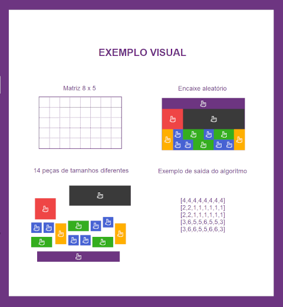

# Projeto_PushStart
Desafio de programação para uma vaga de estágio na PushStart

## Status
* 90% completo
* Falta apenas arrumar a exibição na ultima tela ( atualmente sendo exibida no console do navegador )

### 🛠 Tecnologias

As seguintes ferramentas foram usadas na construção do projeto:

- [React](https://pt-br.reactjs.org/)

# Descrição do desafio

# Desafio PushStart

Desafio PushStart
Crie um código que recebe uma matriz bidimensional e uma lista de peças com seus respectivos tamanhos e números de identificação.

O código deve encaixar de forma aleatória todas as peças na matriz, sem que haja sobreposição entre elas. A cada execução, o resultado deve ser diferente do anterior.

O código deve suportar o uso de diferentes tamanhos de matriz, quantidades de peças e formatos das peças.

O resultado do processamento deve ser uma matriz preenchida com os identificadores dos blocos.

Obs: não é necessário exibir o visual como na imagem a cima, basta que o código retorne a matriz conforme mostrado no exemplo de saída do algorítmo.

##Regras
* O desafio pode ser resolvido em qualquer linguagem de programação
* O código deve estar disponível no Bitbucket, GitHub ou GitLab
* O repositório deve incluir instruções para execução do código
* A definição dos formatos de entrada e saída é livre
* A organização do código é um critério para avaliação

# Como rodar o projeto

## Pré-requisitos

Antes de começar, você vai precisar ter instalado em sua máquina as seguintes ferramentas:
[Git](https://git-scm.com), [Node.js](https://nodejs.org/en/). 
Além disto é bom ter um editor para trabalhar com o código como [VSCode](https://code.visualstudio.com/)

## Clone este repositório
$ git clone <https://github.com/MatheusPrudencio/Projeto_PushStart>

## Acesse a pasta do projeto no terminal/cmd
$ cd pushstart

## Vá para a pasta server
$ cd server

## Instale as dependências
$ npm install

## Execute a aplicação
$ npm run 

## O servidor inciará na porta:3333 - acesse <http://localhost:3333> 

Então você ira navegar dentro da aplicação

### O resultado final ira aparecer no console do navegador, na próxima versão isso será corigido

